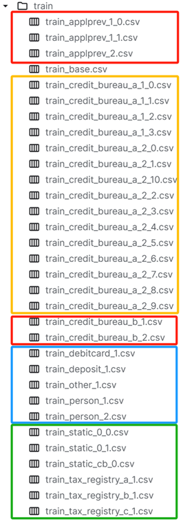
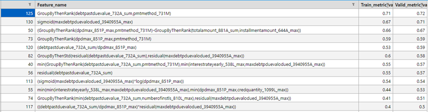
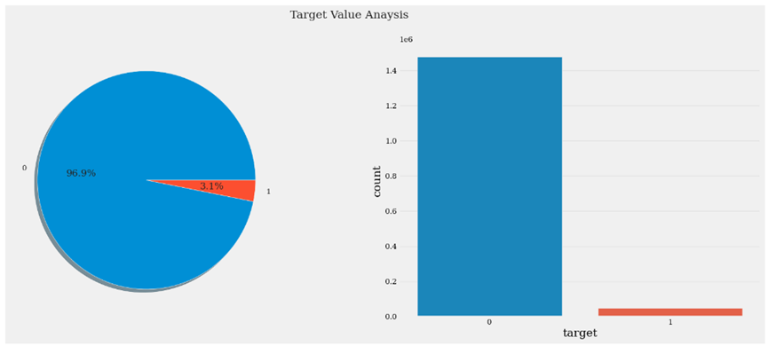
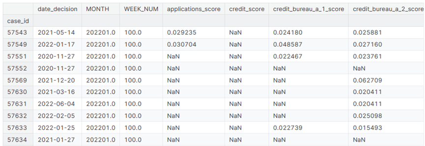
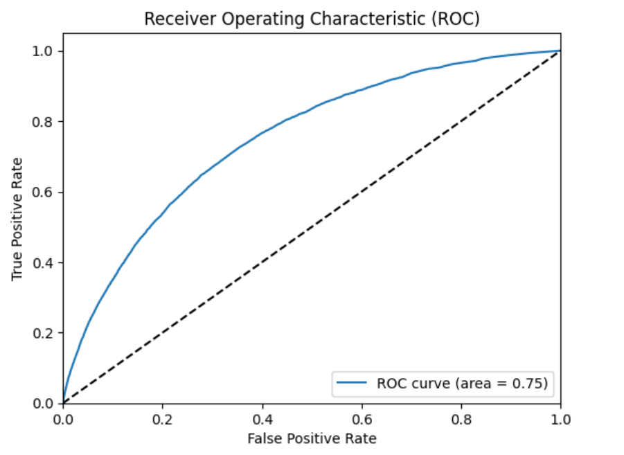

# Home Credit - Credit Risk Model Stability

The final project of class **Machine Learning for Finance 2024**
student1: Deng Tingqin 2301212321 Fintech
student2: Niu Yitong 2301212368 Quantitative Finance
Supervisor: Professor Choi

## Background

Our question and dataset originate from an ongoing Kaggle competition titled "Home Credit - Credit Risk Model Stability" (https://www.kaggle.com/competitions/home-credit-credit-risk-model-stability). The aim of this competition is to predict which clients are more likely to default on their loans. Currently, there are 3,503 participants and 2,771 teams, competing for prizes and medals totaling up to $105,000. Our contribution to assessing potential clients' default risks will empower consumer finance providers to approve more loan applications, potentially improving the lives of individuals historically denied credit due to lack of credit history.

## Question Description

The dataset is highly diverse, consisting of multiple sub-datasets generated from various segments. These segments include not only internal departments but also external institutions. For instance, the applprev datasets originate from the internal previous loan application segment, while the tax registry datasets are sourced from government taxation data. Each case ID (a piece of prediction sample) may appear in some segments but not in others. This presents challenges in constructing a model. Besides, even for a case id in one segment, there are always many missing values, posing great difficulties for data analysis. Another challenging part of the dataset is that, for one table, it may have what so-call ‘depth’. For depth=0, these are static features directly tied to a specific case_id. For depth=1 - Each case_id has an associated historical record, indexed by num_group1. For depth=2 - Each case_id has an associated historical record, indexed by both num_group1 and num_group2. This means that each case_id may have multiple data pieces in one table, which requiring feature aggregation. The evaluation metric of this problem is gini, which equals to **gini=2*AUC-1**.



## Feature Engineering

1.Feature Aggregation
As we mentioned above, one challenging part of the dataset is that each case_id may have multiple data pieces in one table, which requires feature aggregation. So, our team looks at the features in every table one by one, aggregating repeated features of a same case id. A small trick here is that we use **polars** package (https://pola.rs/) rather than pandas, since polars is proven to be much faster than pandas. Here is a sample of how we conducted feature aggregation at the table applprev with polars.
And another trick is that each time we gained our processed tables, we delete original ones and use **gc.collect()** to save memory. Since this is a Kaggle competition and it has strict memory requirements.

```python
def process_appl_tables(appl1_0, appl1_1):
    appl1 = pl.concat([appl1_0, appl1_1], how="vertical_relaxed")
    # one-hot features
    appl1_one_hot_feat = appl1.sort(['case_id', 'creationdate_885D']).unique(['case_id'])\
            [['credtype_587L', 'education_1138M', 'familystate_726L']]\
            .fill_null('unknown').to_dummies()
    # aggregation features
    appl1_feats = appl1.group_by("case_id").agg(
        pl.col("actualdpd_943P").max().alias("actualdpd_943P_max"),
        pl.col("annuity_853A").max().alias("annuity_853A_max"),
        (pl.col("approvaldate_319D").is_null()==False).sum().alias("any_prev_approval"),
        pl.col("byoccupationinc_3656910L").mean().alias("byoccupationinc_3656910L_mean"),
        pl.col('childnum_21L').max().alias('childnum_21L_max'),
        pl.col('credacc_actualbalance_314A').mean().alias('credacc_actualbalance_314A_mean'),
        pl.col('credacc_credlmt_575A').max().alias('credacc_credlmt_575A_max'),
        pl.col('credamount_590A').max().alias('credamount_590A_max'),
        pl.col('currdebt_94A').max().alias('currdebt_94A_max'),
        pl.col('downpmt_134A').max().alias('downpmt_134A_max'),
        (pl.col("dtlastpmt_581D").is_null()==False).any().alias("any_dtlastpmt"),
        pl.col('mainoccupationinc_437A').mean().alias('mainoccupationinc_437A_mean'),
        pl.col('outstandingdebt_522A').max().alias('outstandingdebt_522A_max'),
    ).sort(['case_id'])
    appl1_feats = pl.concat([appl1_feats, appl1_one_hot_feat], how="horizontal").fill_null(-1)
    return appl1_feats

train_appl_feats = process_appl_tables(appl1_0, appl1_1).to_pandas()
test_appl_feats = process_appl_tables(appl1_0_test, appl1_1_test).to_pandas()
missing_columns = [col for col in train_appl_feats.columns if col not in test_appl_feats.columns]
test_appl_feats[missing_columns] = 0
test_appl_feats = test_appl_feats[train_appl_feats.columns].fillna(-1)
print(train_appl_feats.shape, test_appl_feats.shape)
# collect to save memory
del appl1_0, appl1_1, appl1_0_test, appl1_1_test
gc.collect()
```

2.Feature Mining
The goal of automated feature generation is to liberate machine learning experts from the laborious task of manual feature generation, which is crucial for improving the learning performance of tabular data. And **OpenFE** is a new framework for automated feature generation for tabular data. Most basically, it uses lgbm models to select good features. Extensive comparison experiments on public datasets show that OpenFE outperforms existing feature generation methods on both effectiveness and efficiency. ***(Zhang, Tianping, et al. "Openfe: Automated feature generation with expert-level performance." International Conference on Machine Learning. PMLR, 2023.)*** We conducted OpenFE on each table after aggregation and for each new generated feature, we evaluated them with a **self-defined metric** - the difference of means between feature values of target 1 and target 0 after standard scaling.

```python
# self-defined metric to evaluate new generated features
def metric(self, feature, label):
    feature = (feature-np.nanmean(feature))/np.nanstd(feature)
    group_0 = feature[label == 0]
    group_1 = feature[label == 1]
    mean_diff = np.abs(np.nanmean(group_0) - np.nanmean(group_1))
    return mean_diff
```

```python
# how to use openfe to generate new features
def one_round_auto_features(self, trainX, validX, categorical_features, n_jobs):
    ofe = OpenFE()
    categorical_features = trainX.columns.intersection(categorical_features)
    trainX_cate, validX_cate = trainX.loc[:, categorical_features], validX.loc[:, categorical_features]
    trainX, validX = self.corr_reduce_dimension(trainX, validX)
    trainX, validX = pd.concat([trainX, trainX_cate], axis=1), pd.concat([validX, validX_cate], axis=1)
    # rename the columns (lgbm required columns to be named purely str)
    cols = trainX.columns
    col_signs = {cols[num]: 'feature_'+'0'*(4-len(str(num)))+str(num) for num in range(len(cols))}
    categorical_features = [col_signs[x] for x in categorical_features]
    trainX = trainX.rename(columns=col_signs)
    validX = validX.rename(columns=col_signs)
    params = {"n_estimators":500, "max_depth":3,
            "importance_type":"gain",
            "num_leaves":10, "seed":1,
            "n_jobs": n_jobs,
            "device":"gpu"}
    # 小数据集(1G)用cpu，大数据集用CUDA
    if self.is_CUDA:
        params["device"] = "CUDA"
    # generate features
    features = ofe.fit(data=trainX, label=self.trainY, 
                        n_jobs=n_jobs, 
                        metric='auc', task='classification',
                        n_data_blocks=8, min_candidate_features=2000,
                        stage2_params=params, 
                        categorical_features=categorical_features)
    trainX, validX = transform(trainX, validX, features, n_jobs=n_jobs)
    col_name_dict = {}
    for col in trainX.columns:
        if 'autoFE_f_' in col:
            col_order = int(col.replace('autoFE_f_', ''))
            formula = tree_to_formula(ofe.new_features_list[col_order])  # find feature formula
        else:
            formula = col
        for original_feature, col_sign in col_signs.items():
            if col_sign in formula:  # renamed columns back
                formula = formula.replace(col_sign, original_feature)
        col_name_dict[col] = formula
    trainX = trainX.rename(columns=col_name_dict)
    validX = validX.rename(columns=col_name_dict)
    # duplicated columns
    trainX = trainX.loc[:, ~trainX.columns.duplicated()]
    validX = validX.loc[:, ~validX.columns.duplicated()]
    # nan or inf columns
    trainX_cols = self.exclude_nan_inf_columns(trainX)
    validX_cols = self.exclude_nan_inf_columns(validX)
    share_cols = trainX_cols.intersection(validX_cols)
    trainX, validX = trainX.loc[:, share_cols], validX.loc[:, share_cols]
    # high correlated columns
    trainX, validX = self.corr_reduce_dimension(trainX, validX)
    features_names = list(set(col_name_dict.values()) & set(trainX.columns))
    return trainX, validX, features_names
```



## Modelling

A problem about the target is that, for credit risk problem, there are always few default cases to leverage. We counted the positive and negative samples in the training set and it turn out that there is server label imbalance problem. To solve the problem, we used **under sampling technique** to maintain the ratios of positive samples to negative sample as 1:1.


1.LGBM
**LightGBM** is a gradient boosting framework that uses tree based learning algorithms. It is developed by Microsoft and designed to be distributed and efficient with the following advantages: Faster training speed and higher efficiency. Lower memory usage. Better accuracy. Support of parallel, distributed, and GPU learning. Capable of handling large-scale data. In many Kaggle competitions, lgbm turns out to be more effective than other tree models. (https://lightgbm.readthedocs.io/en/latest/index.html) We developed a lgbm model with **5-fold cross validation**. And, we used **early stopping** tricks to optimize training process.
And we also used **Optuna** for hyperparameter tuning. Optuna is an automatic hyperparameter optimization software framework, particularly designed for machine learning. It features an imperative, define-by-run style user API. Thanks to our define-by-run API, the code written with Optuna enjoys high modularity, and the user of Optuna can dynamically construct the search spaces for the hyperparameters. (https://github.com/optuna/optuna)

```python
import optuna  # pip install optuna
from sklearn.model_selection import StratifiedKFold
from scipy.special import softmax
# from optuna.integration import LightGBMPruningCallback  ##callback类很方便，它可以在对数据进行训练之前检测出不太好的超参数集，从而显着减少搜索时间。

def objective_lgbm(trial, X, y, ctg_features):
    param_grid = {
        'objective': 'binary',
        'boosting_type': 'gbdt',  ###
        'metric': 'auc',
        'learning_rate': trial.suggest_loguniform('learning_rate', 1e-5, 1e-2),
        'n_estimators': 10000,
        'num_leaves': trial.suggest_int('num_leaves', 10, 100),
        'max_depth': trial.suggest_int('max_depth', 3, 15),
        "seed": 42,
        "random_state": 2024,
    }
   
    cv = StratifiedKFold(n_splits=5, shuffle=True, random_state=1121218)  

    cv_scores = np.empty(5)
    for idx, (train_idx, test_idx) in enumerate(cv.split(X, y)):
        X_train, X_valid = X.iloc[train_idx], X.iloc[test_idx]
        y_train, y_valid = y.iloc[train_idx], y.iloc[test_idx]

        lgb_train = lgbm.Dataset(X_train, label=y_train, categorical_feature=ctg_features, free_raw_data=False)
        lgb_valid = lgbm.Dataset(X_valid, label=y_valid, reference=lgb_train, categorical_feature=ctg_features, free_raw_data=False)
        lgbm_model = lgbm.train(
            param_grid,
            lgb_train,
            valid_sets=lgb_valid,
            callbacks=[lgbm.log_evaluation(50), lgbm.early_stopping(10)]
        )

        preds = lgbm_model.predict(X_valid)
        prob = softmax(preds)

        cv_scores[idx] = roc_auc_score(y_valid, prob)
        if not os.path.exists('lgbm_model'):
            os.makedirs('lgbm_model')
        model_filename = f'lgbm_model/lgbm_CV_{idx}.txt'
        lgbm_model.save_model(model_filename)
        print(f"Model for fold saved to {model_filename}")
    print(cv_scores)
    return cv_scores

def CV_for_lgbm(X, y, ctg_features):
    study = optuna.create_study(direction="maximize", study_name="LGBM")
    func = lambda trial: objective_lgbm(trial, X, y, ctg_features)
    study.optimize(func, n_trials=10)

    print(f"\tBest value (auc): {study.best_value:.5f}")
    print(f"\tBest params:")
    with open('lgbm_model/test.txt','w') as f:
        f.write(f"\tBest value (auc): {study.best_value:.5f}")
        f.write(f"\tBest params:")

    for key, value in study.best_params.items():
        with open('lgbm_model/test.txt','a') as f:
            f.write(f"\t\t{key}: {value}")
            print(f"\t\t{key}: {value}")
            
    param_grid = {
        'objective': 'binary',
        'boosting_type': 'gbdt',  ###
        'metric': 'auc',
        'learning_rate': study.best_params['learning_rate'],
        'n_estimators': 10000,
        'num_leaves': study.best_params['num_leaves'],
        'max_depth': study.best_params['max_depth'],
        "seed": 42,
        "random_state": 2024,
    }

    cv = StratifiedKFold(n_splits=5, shuffle=True, random_state=1121218) 

    cv_scores = np.empty(5)
    for idx, (train_idx, test_idx) in enumerate(cv.split(X, y)):
        X_train, X_valid = X.iloc[train_idx], X.iloc[test_idx]
        y_train, y_valid = y.iloc[train_idx], y.iloc[test_idx]

        lgb_train = lgbm.Dataset(X_train, label=y_train, categorical_feature=ctg_features, free_raw_data=False)
        lgb_valid = lgbm.Dataset(X_valid, label=y_valid, reference=lgb_train, categorical_feature=ctg_features, free_raw_data=False)
        lgbm_model = lgbm.train(
            param_grid,
            lgb_train,
            valid_sets=lgb_valid,
            callbacks=[lgbm.log_evaluation(50), lgbm.early_stopping(10)]
        )
      
        preds = lgbm_model.predict(X_valid)
        prob = softmax(preds)
       
        cv_scores[idx] = roc_auc_score(y_valid, prob)
        if not os.path.exists('lgbm_model'):
            os.makedirs('lgbm_model')
        model_filename = f'lgbm_model/lgbm_CV_{idx}.txt'
        lgbm_model.save_model(model_filename)
        print(f"Model for fold saved to {model_filename}")
    print(cv_scores)
```

2.2-layers MLP
For model stability, we also trained deep learning models so that we could combine tree models and neural networks together to get a more stable result.

```python
# define MLP
class MLP(nn.Module):
    def __init__(self, input_dim, hidden_dim, output_dim):
        super(MLP, self).__init__()
        self.fc1 = nn.Linear(input_dim, hidden_dim)
        self.fc2 = nn.Linear(hidden_dim, output_dim)
        self.hidden1 = nn.BatchNorm1d(hidden_dim)
        self.relu = nn.ReLU()
        self.sigmoid = nn.Sigmoid()
        
    def forward(self, x):
        x = self.hidden1(self.relu(self.fc1(x)))
        x = self.fc2(x)
        return x
```

## Ensemble Learning and Segments Combination

For each table, we get the average forecasting probe of lgbm and mlp models. And for each case, we could get the default probes from many segments’ datasets, and we simply averages the default probes of all segments to get the final default probes of a case.

The ROC curve based on train dataset is drawn below.


The final score we got now is 0.58, which was ranked at **758/2,771**.
